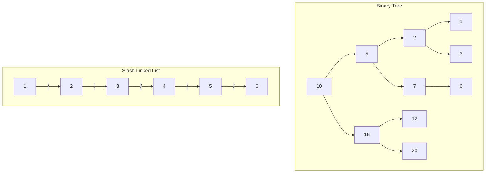
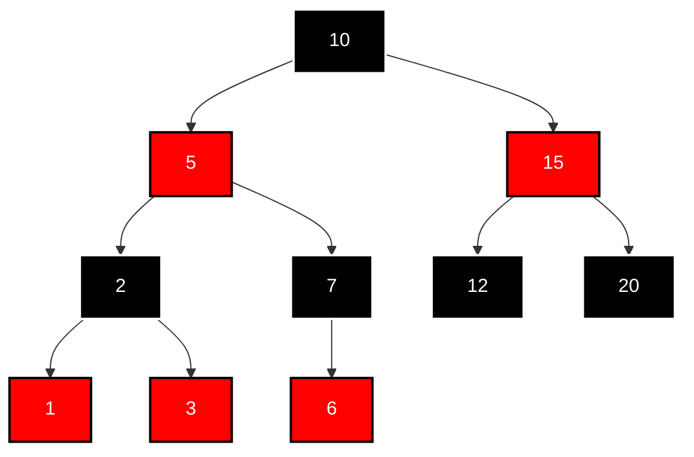

# 常见问题

## 字符集问题

修改mysql的数据陆慕下的my.ini的配置文件(Windows系统)

```ini
[mysql] #大概在63行左右，在其下添加
default-character-set=utf8 #默认字符集

[mysqld] # 大概在76行左右，在其下添加
character-set-server=utf8 collation-server=utf8_general_ci
```

> 注意：建议修改配置文件使用notepad++等高级文本编辑器，使用记事本等软件打开修改后可能会导致文件编码修改为“含BOM头”的编码，从而服务重启失败

重启服务,再查看一次编码

> 修改编码前,已经创建的表和库,修改编码后不会自动更改,需要重新建库表或者手动修改库表的编码

手动修改库表的编码

```sql
#修改数据库的字符编码为utf8 
alter database test charset utf8; 

#修改表字符编码为UTF8
alter table student charset utf8; 

#修改字段字符编码为UTF8
alter table student modify name varchar(20) charset utf8; 
```

## 客户端连接的问题

旧版本图形界面工具连接MySQL8时出现`Authentication plugin caching_sha2_password' cannot be loaded`错误。

MySQL8之前的版本中加密规则是`mysql_native_password`，

MySQL8之后的加密规则是`caching_sha2_password`

解决问题:

修改用户名为“root@localhost”的用户密码规则为“mysql_native_password”，密码值为“123456”

```sql
# 查看所有数据库
mysql> show databases;
+--------------------+
| Database           |
+--------------------+
| information_schema |
| mysql              |
| performance_schema |
| ry-vue             |
| sys                |
+--------------------+
5 rows in set (0.01 sec)

# 使用mysql数据库,不需要要分号,其余的命令要加分号
use mysql;

# 修改'root'@'localhost'用户的密码规则和密码
ALTER USER 'root'@'localhost' IDENTIFIED WITH mysql_native_password BY 'abc123';
FLUSH PRIVILEGES;

# 开启远程访问
UPDATE user SET host='%' WHERE user='root';
FLUSH PRIVILEGES;
```

## 存过报错

报错信息:

```shell
[Err] 1418 - This function has none of DETERMINISTIC, NO SQL, or READS SQL DATA in its declaration and binary logging is enabled (you *might* want to use the less safe log_bin_trust_function_creators variable)
```

我们就必须指定我们的函数是否是:

- DETERMINISTIC 不确定的
- NO SQL 没有SQl语句
- READS SQL DATA 只是读取数据
- MODIFIES SQL DATA 要修改数据
- CONTAINS SQL 包含SQL语句

其中在function/procedure 里面，只有 DETERMINISTIC, NO SQL 和 READS SQL DATA 被支持。

如果我们开启了 bin-log, 我们就必须为我们的function/procedure 指定一个参数。

解决方法:


<!-- tab 方法1:临时修改-->

```bash
# 在mysql数据库中执行以下语句 （临时生效，重启后失效）
set global log_bin_trust_function_creators=TRUE;
# 或者
set global log_bin_trust_function_creators=1;
```
<!-- endtab -->

<!-- tab 方法2配置文件修改-->

```bash
# 在配置文件/etc/my.cnf的[mysqld]或者my-default.ini文件中配置
log_bin_trust_function_creators=1
```
<!-- endtab -->

<!-- tab 方法3:执行sql的时候添加信息-->

```sql
CREATE DEFINER=`root`@`localhost` FUNCTION test(param bigint) RETURNS decimal(10,0)
# 需要添加这个READS SQL DATA
READS SQL DATA
BEGIN
  ....

RETURN .....;
END
```
<!-- endtab -->



# 常用SQL例子

```sql
-- select 嵌套子查询
select 
  (select count(id) from user_info) as a,
  (select count(id) from user_info where age > 10) as b;
```

```sql
-- 用到的函数,查询日期
select curdate();
select date(now());
```

```sql
/* user_info已经筛选过一次, 再这之后再筛选一次 用的金额 */
SELECT 
    SUM(CASE WHEN status = 1 THEN amount ELSE 0 END) AS '冻结的用户的总金额',
    SUM(CASE WHEN status = 2 THEN amount ELSE 0 END) AS '活跃的用户的总金额'
FROM 
    user_info where register between '2020-02-02' and '2023-02-02';
```

```sql
-- insert的字段数据,需要查询出来的数据
insert into bank_info(bank_code, bank_name)
VALUES ('NEW', (select user_no from user_fund_info where id = 46));
```

# 优化的例子

优化大表的查询,查询一张流水表,要统计开始时间和时间之间的数据

```sql
-- 业务是:一个用户,流水在这个时间段最多只有一条记录,并且查询所有用户在这个时间段一共有多少条记录
-- 流水表目前的数据量有70w
-- 这样查询,需要好几秒的时间,explain的行数是70w
SELECT
	count(1)
FROM
	users AS t1
	LEFT JOIN liushui AS t2 ON t1.id = t2.user_id and t2.begin_time <= '2023-09-14 21:01:28' AND t2.open_time >= '2023-09-14 21:01:28' ;
	
-- 进行优化
-- 增加了一个belong_date的字段,并且添加索引
-- begin_time 和 open_time 有可能之间跨天了,所以belong_date要筛选两天的
-- explain的行数只有2000多条
SELECT
	count(1)
FROM
	users AS t1
	LEFT JOIN liushui AS t2 ON t1.id = t2.user_id AND t2.belong_date IN ('2023-09-14','2023-09-13') and t2.begin_time <= '2023-09-14 21:01:28' AND t2.open_time >= '2023-09-14 21:01:28' ;
	
-- 再进行优化
-- 上面的sql和这个sql explain 看着差不多一样,索引出来的流水表的数据量都是一样,可就是上面这条记录查询慢,下面这条记录查询快
-- explain的行数只有2000多条
-- 查询查询出来的效果是,先用belong_date查一遍,再在子查询的结果集再筛选一遍
SELECT
	COUNT( 1 ) 
FROM
	(
	SELECT
		t1.id
		t2.begin_time, # 这两个时间字段对业务是没有用的,是为了外面这个查询使用到
		t2.open_time 
	FROM
		lottery_open AS t1
		LEFT JOIN lottery_period AS t2 ON t1.id = t2.lottery_id 
	AND t2.belong_date IN ( CURDATE(), DATE_SUB( CURDATE(), INTERVAL 1 DAY ) )) AS t3 
WHERE
	t3.begin_time <= '2023-09-14 21:01:28' AND t3.open_time >= '2023-09-14 21:01:28';
```

# 实战

## mysql使用source导入数据

导入的数据,中文乱码,只要先执行uft-8登录之后,再导入数据

```shell
# 登录mysql
mysql -u root -p --default-character-set=utf8

# 显示所有数据库
show databases;

# 选择数据库
use [数据库]

# 导入文件
mysql> source d:\mysqldb.sql
```

## 导出

```shell
# --default-character-set=utf8 编码
# -h 192.168.8.2 数据库地址
# -u root 数据库用户名
# -p
# test 数据库库名
# test.sql 导出sql的文件名
mysqldump --default-character-set=utf8 --single-transaction --set-gtid-purged=OFF -h 192.168.8.2 -u root -p test > test.sql
```

## 语法

**比较运算符**

```sql
# 字符串存在隐式转换,如果转换不成功,就看做0
# 两边的值一个是整数，另一个是字符串，则MySQL会将字符串转化为数字进行比较。
# 两边的值都是整数，则MySQL会按照整数来比较两个值的大小。
mysql> select 1=1,1=2,1!=2,2='2',1='a',0='a';
+-----+-----+------+-------+-------+-------+
| 1=1 | 1=2 | 1!=2 | 2='2' | 1='a' | 0='a' |
+-----+-----+------+-------+-------+-------+
|   1 |   0 |    1 |     1 |     0 |     1 |
+-----+-----+------+-------+-------+-------+
1 row in set, 2 warnings (0.00 sec)

# 字符串和字符串比较,就不隐式转换了
mysql> select 'a'='a','ab'='ab','a'='b';
+---------+-----------+---------+
| 'a'='a' | 'ab'='ab' | 'a'='b' |
+---------+-----------+---------+
|       1 |         1 |       0 |
+---------+-----------+---------+
1 row in set (0.00 sec)

# 两边的值、字符串或表达式中有一个为NULL，则比较结果为NULL。
mysql> select 1=null,null=null;
+--------+-----------+
| 1=null | null=null |
+--------+-----------+
|   NULL |      NULL |
+--------+-----------+
1 row in set (0.01 sec)
```

**安全等于运算符**

安全等于运算符`<=>`与等于运算符`=`的作用是相似的,唯一的区别:`<=>`可 以用来对NULL进行判断。

在两个操作数均为NULL时，其返回值为1，而不为NULL;当一个操作数为NULL 时，其返回值为0，而不为NULL。

```sql
mysql> select 1<=>1,1<=>2,2<=>'2',1<=>'a',0<=>'a';
+-------+-------+---------+---------+---------+
| 1<=>1 | 1<=>2 | 2<=>'2' | 1<=>'a' | 0<=>'a' |
+-------+-------+---------+---------+---------+
|     1 |     0 |       1 |       0 |       1 |
+-------+-------+---------+---------+---------+
1 row in set, 2 warnings (0.00 sec)


mysql> select 'a'<=>'a','ab'<=>'ab','a'<=>'b';
+-----------+-------------+-----------+
| 'a'<=>'a' | 'ab'<=>'ab' | 'a'<=>'b' |
+-----------+-------------+-----------+
|         1 |           1 |         0 |
+-----------+-------------+-----------+
1 row in set (0.00 sec)

mysql> select 1<=>null,null<=>null;
+----------+-------------+
| 1<=>null | null<=>null |
+----------+-------------+
|        0 |           1 |
+----------+-------------+
1 row in set (0.00 sec)


#查询commission_pct等于0.40
# 有数据
SELECT employee_id,commission_pct FROM employees WHERE commission_pct = 0.40;

# 没有数据
SELECT employee_id,commission_pct FROM employees WHERE commission_pct = null;

# 有数据
SELECT employee_id,commission_pct FROM employees WHERE commission_pct is null;

# 有数据
SELECT employee_id,commission_pct FROM employees WHERE commission_pct <=> 0.40; 

# 只会查出commission_pct = null的
SELECT employee_id,commission_pct FROM employees WHERE commission_pct <=> null; 
```

**非空运算符**

```sql
#查询commission_pct等于NULL。比较如下的四种写法
SELECT employee_id,commission_pct FROM employees WHERE commission_pct IS NULL; 
SELECT employee_id,commission_pct FROM employees WHERE commission_pct <=> NULL;
# 有点像调用函数了,也是判断null的
SELECT employee_id,commission_pct FROM employees WHERE ISNULL(commission_pct);
# 不要这样写
SELECT employee_id,commission_pct FROM employees WHERE commission_pct = NULL;

# 习惯用就用,不习惯就换一种用法
SELECT employee_id,commission_pct FROM employees WHERE NOT commission_pct <=> NULL;
```

**between and**

```sql
# 查看年纪在23到230之间
select * from table where age between 23 and 230

# 查询年纪不再23和230之间的
select * from table where age not between 23 and 230
```

**In 和 not in**

```sql
# in
select  last_name,salary,department_id from employees where department_id in(10,20,30);

# not in
select  last_name,salary,department_id from employees where department_id  not in(10,20,30);
```

**or**

```sql
# 这两个查询出来的结果是不一样的,一定要仔细
select  last_name,salary,department_id from employees where department_id=10 or department_id=20 or department_id=30

select  last_name,salary,department_id from employees where department_id=10 or 20 or 30
```

**like**

```sql
# %代表不确定个数的字符
select  last_name from employees where last_name like '%a%';

# %代表不确定个数的字符
select  last_name from employees where last_name like 'a%';

# 包含字符a 并且 好办字符e的
# 第一种写法
select  last_name from employees where last_name like '%a%' and last_name like '%e%' ;
# 第二种写法
select  last_name from employees where last_name like '%a%e%' or last_name like '%e%a%';
# 第三种写法
# 强制第二个符号是a的,_表示一个不确定的字符
select  last_name from employees where last_name like '_a%';

# 转义字符
# 查询第二个字符是下划线,并且第三个字符串是a的员工
select  last_name from employees where last_name like '_\_a%';

# 或者
# 告诉mysql,&是我自定义的转移字符
select  last_name from employees where last_name like '_&_a%' escape '&';
```

**正则表达式**

```sql
mysql> SELECT 'shkstart' REGEXP '^s', 'shkstart' REGEXP 't$', 'shkstart' REGEXP 'hk';
+------------------------+------------------------+------------------------+
| 'shkstart' REGEXP '^s' | 'shkstart' REGEXP 't$' | 'shkstart' REGEXP 'hk' |
+------------------------+------------------------+------------------------+
|                      1 |                      1 |                      1 |
+------------------------+------------------------+------------------------+
1 row in set (0.01 sec)
```

**NOT或者!**

* 当给定的值为0 (False)时 NOT FALSE => 1

* 当给定的值为非0值时返回0;

* 当给定的值为NULL时，返回NULL。

```sql
# 把1当做true
# NOT1  ==> Not True== False=0
# not(2)==>2 是true ==>false=0
# NOT !1==> NOT !True ==> NOT False==> True ==>1
mysql> SELECT 1=1,NOT 1, NOT 0, NOT(1+1),not(2), NOT !1, NOT NULL;
+-----+-------+-------+----------+--------+--------+----------+
| 1=1 | NOT 1 | NOT 0 | NOT(1+1) | not(2) | NOT !1 | NOT NULL |
+-----+-------+-------+----------+--------+--------+----------+
|   1 |     0 |     1 |        0 |      0 |      1 |     NULL |
+-----+-------+-------+----------+--------+--------+----------+
1 row in set, 1 warning (0.00 sec)
```

**AND或者 &&**

当给定的所有值均为非0值，并且都不为NULL时，返回 1;

当给定的一个值或者多个值为0时则返回0;

否则返回NULL。

```sql
# 1 理解成True,其它的值就不管用
# 1 or -1 ,有一路是通电的,那就是通电的
mysql> SELECT 1 OR -1, 1 OR 0, 1 OR NULL, 0 || NULL, NULL || NULL;
+---------+--------+-----------+-----------+--------------+
| 1 OR -1 | 1 OR 0 | 1 OR NULL | 0 || NULL | NULL || NULL |
+---------+--------+-----------+-----------+--------------+
| 1| 1| 1|NULL| NULL| +---------+--------+-----------+-----------+--------------+ 1 row in set, 2 warnings (0.00 sec)
```

**limit**

格式:`LIMIT [位置偏移量,] 行数`

* 第一个“位置偏移量”参数指示MySQL从哪一行开始显示，是一个可选参数，如果不指定“位置偏移 量”，将会从表中的第一条记录开始(第一条记录的位置偏移量是0，第二条记录的位置偏移量是 1，以此类推);

* 第二个参数“行数”指示返回的记录条数。

> MySQL 8.0中可以使用“LIMIT 3 OFFSET 4”，意思是获取从第5条记录开始后面的3条记录，和“LIMIT 4,3;”返回的结果相同。

分页显式公式 :(当前页数-1)*每页条数，每页条数

```sql
SELECT * FROM table LIMIT(PageNo - 1)*PageSize,PageSize;
```

* 注意:LIMIT 子句必须放在整个`SELECT`语句的最后!

**order by**

单列排序

```sql
# 默认升序
select salary from employees order by salary

# 使用列的别名,进行排序
select salary,salary*12 as year_salary from employees order by year_salary
```

多列排序

```sql
select employee_id, salary, department_id
from employees
order by department_id DESC,salary ASC;
```

* 可以使用不在SELECT列表中的列排序。 
* 在对多列进行排序的时候，首先排序的第一列必须有相同的列值，才会对第二列进行排序。如果第 一列数据中所有值都是唯一的，将不再对第二列进行排序。

## 时间字段

|                             | date        | datetime    | timestamp |
| --------------------------- | ----------- | :---------- | --------- |
| 插入时间(CURRENT_TIMESTAMP) | 不行(now()) | 不行(now()) | 可以      |
| 自动更新(CURRENT_TIMESTAMP) | 不行        | 可以        | 可以      |
| 时区                        |             | 时间字符串  | 保存时区  |

```sql
# 插入的时候,自动插入时间 设置CURRENT_TIMESTAMP
--添加CreateTime 设置默认时间 CURRENT_TIMESTAMP 
ALTER TABLE `test_time` ADD COLUMN  `my_time_date` datetime NULL DEFAULT CURRENT_TIMESTAMP COMMENT '创建时间' ;

--修改CreateTime 设置默认时间 CURRENT_TIMESTAMP 
ALTER TABLE `test_time` MODIFY COLUMN  `my_time_date` datetime NULL DEFAULT CURRENT_TIMESTAMP COMMENT '创建时间' ;

 
# 更新的时候自动更新时间 设置CURRENT_TIMESTAMP
--添加UpdateTime 设置 默认时间 CURRENT_TIMESTAMP   设置更新时间为 ON UPDATE CURRENT_TIMESTAMP 
ALTER TABLE `test_time` ADD COLUMN `my_time_date` timestamp NULL DEFAULT CURRENT_TIMESTAMP ON UPDATE CURRENT_TIMESTAMP COMMENT '创建时间' ;

--修改 UpdateTime 设置 默认时间 CURRENT_TIMESTAMP   设置更新时间为 ON UPDATE CURRENT_TIMESTAMP 
ALTER TABLE `test_time` MODIFY COLUMN `my_time_date` timestamp NULL DEFAULT CURRENT_TIMESTAMP ON UPDATE CURRENT_TIMESTAMP COMMENT '创建时间' ;
```

> 参考:[MySQL 的 timestamp时区问题](https://zhuanlan.zhihu.com/p/569416633)

## 时区

```sql
# 查询时区
# 不需要看system_time_zone,只需要修改time_zone
mysql> show variables like '%time_zone%';
+------------------+--------+
| Variable_name    | Value  |
+------------------+--------+
| system_time_zone | UTC    |
| time_zone        | +08:00 |
+------------------+--------+
2 rows in set (0.01 sec)

# 查询全局时区,和会话时区
mysql> select @@GLOBAL.time_zone,@@SESSION.time_zone;
+--------------------+---------------------+
| @@GLOBAL.time_zone | @@SESSION.time_zone |
+--------------------+---------------------+
| +08:00             | +08:00              |
+--------------------+---------------------+
1 row in set (0.00 sec)

# 设置会话时区
set time_zone='+8:00';

# 设置全局时区
# 全局会话有效。必须重新连接才生效
set global time_zone='+8:00;

# 修改 mysql 的配置文件永久设置时区
[mysqld]
default-time-zone=+08:00
```

**mysql当前在什么时区，看哪个变量**

看 time_zone,不看 system_time_zone。如要修改时区，直接修改 time_zone，无视 system_time_zone

**time_zone 的值如果是 SYSTEM 表示什么?**

表示跟 system_time_zone 取值一样。安装MySQL后默认就是SYSTEM

**system_time_zone 的值是怎么来的?**

它的值来自mysql服务启动时读取操作系统时区，读取后即使修改操作系统的时区，它的值也不会再改变了，除非重启mysql 服务变量重新读取

**system_time_zone 的值能改变吗?**

```shell
# 不能通过命令改变
mysql> set system_time_zone='JST';
ERROR 1238 (HY000): Variable 'system_time_zone' is a read only variable
```

> 参考:[关于mysql的时区](https://blog.csdn.net/w8y56f/article/details/115445442)

# 索引

## 数据结构

### 二叉树

二叉树的缺点:顺序插入,会变成一个链表,层级比较深,检索速度慢,可以使用红黑树解决这个问题



### 红黑树

红黑树是一个自平衡的二叉树,大数据情况下,层级较深,检索速度慢



### B-Tree和B+树的区别

- **B树**：查找时可能在内部节点就能找到所需的值。
- **B+树**：查找时需要遍历到叶子节点才能找到所需的值，因为所有的值都存储在叶子节点中。

**范围查询**：

- **B树**：范围查询需要在树中进行多次查找，并且由于叶子节点之间没有链接，范围查询可能效率较低。
- **B+树**：由于叶子节点形成了一个链表，范围查询可以从一个叶子节点顺序访问到下一个，效率更高。

**插入和删除**：

- **B树**：插入和删除操作可能会影响到所有节点，因为值存储在所有节点中。
- **B+树**：插入和删除操作主要影响叶子节点，内部节点只需要更新键和指针。这种结构使得B+树的插入和删除操作相对简单。

**索引覆盖/覆盖索引**

select 后面的字段可以从索引中获取到数据,就是`索引覆盖`,避免回标操作

比如user表,有id,name和age两个字段,id是主键索引,name是普通索引,age没有索引,select age 就是没有使用索引覆盖

如果不符合最左前缀匹配,虽然是索引覆盖,也是无法用到索引,回扫描索引树


**索引下推**

是5.6之后才有的,默认开启,可以设置`index_condition_pushdown=off`关闭掉

用类似官网的例子,user表,有id(主键),name,age三个字段,使用name,age建立一个普通索引

1,anthony,18

2,anthony,19

查询`select *from user where name='anthony' and age != 18`

如果没有使用下推,存储引擎中会查询到 name='anthony'的数据行,得到行主键索引,比如有两个name='anthony',比如第一行和第四行,那么主键id就是1和2,分别用1和2去聚簇索引中查找匹配的行数据,返回给mysql server层,再过滤age!= 18 ,这就会涉及到两次回表,分别是id=1和id=2

如果使用索引下推,直接在存储引擎中通过where的筛选条件,直接在存储引擎中得到行数据,再回表查询,这样就只是需要回标一次,因为只有一行数据是符合`name='anthony' and age != 18`

使用了索引下推,执行explain计划的时候,extra的会显示`Using index condition`


**回表**

主键索引的B+树的叶子节点存储的是整行数据,

非主键索引的B+树的叶子节点存储的是主键的值

当查询根据非聚簇索引查询的时候,会先通过非聚簇索引查询到主键的值,然后再需要通过主键的值再进行一次查询才能得到要查询的数据,这个过程就是回表


**主键索引为什么快**

## explain

* Possible_key  理论上用到的key
  * 值有可能有多个,也有可能是`null`
* key  实际用到的可以
  * 如果值是primary 就是主键索引
* row   SQL执行过程中会被扫描的行数，该数值越大，意味着需要扫描的行数，相应的耗时更长

# 事务

ACID

* 原子性:同时成功,或者同时失败,`undo log`日志, 比如插入一条记录,undo就会保存一条delete日志
* 一致性:业务代码正确逻辑保证,比如try catch了异常,导致事务不能回滚
* 隔离性别:
* 持久性:一旦提交了事务,它对数据库的改变就是应该永久性的,持久性由`redo log`日志来保证

## 隔离级别

|      | 隔离级别                     | 脏读 | 不可重复读 | 幻读 |
| ---- | ---------------------------- | ---- | ---------- | ---- |
|      | 读未提交（Read Uncommitted） | ✅    | ✅          | ✅    |
| mvcc | 读已提交（Read Committed）   | X    | ✅          | ✅    |
| mvcc | 可重复读（Repeatable Read）  | X    | X          | ✅    |
| 锁   | 串行化（Serializable）       | X    | X          | X    |

* 读未提交,查询到别的事务修改但是没有提交的数据
* 不可重复读和幻读都是同一事务类,读取的结果不一样
* 区别:
  * 不可重复读:别的事务更新操作导致的
  * 幻读,别的事务插入或者删除导致的


### 数据库准备

SQL:

```sql
CREATE TABLE `mytest` (
  `id` int NOT NULL AUTO_INCREMENT,
  `name` varchar(255) DEFAULT NULL,
  `amount` decimal(10,2) DEFAULT NULL,
  PRIMARY KEY (`id`)
) ENGINE=InnoDB;


INSERT INTO `lottery`.`mytest` (`id`, `name`, `amount`) VALUES (1, 'anthony', 100.00);
INSERT INTO `lottery`.`mytest` (`id`, `name`, `amount`) VALUES (2, 'nick', 200.00);
```

命令:设置会话登记

```sql
SET SESSION TRANSACTION ISOLATION LEVEL READ UNCOMMITTED;

set SESSION TRANSACTION ISOLATION LEVEL READ COMMITTED;
```


> 演示过程都是,事务A先操作,然后事务B再操作

### 读未提交

读未提交(read-uncommitted),演示一

|      |                            事务A                             |                            事务B                             |                    |
| ---: | :----------------------------------------------------------: | :----------------------------------------------------------: | ------------------ |
|      |                                                              |                                                              | anthony.amount=100 |
|    1 |                            BEGIN;                            |                            BEGIN;                            |                    |
|    2 | UPDATE mytest <br/>	SET amount = amount + 500 <br/>	WHERE<br/>		id = 1; |                                                              |                    |
|    3 |                                                              | BEGIN;<br/>	SELECT<br/>		* <br/>	FROM<br/>		mytest <br/>WHERE<br/>	id = 1; | anthony.amount=600 |
|    4 |                           commit;                            |                                                              |                    |
|      |                                                              | BEGIN;<br/>	SELECT<br/>		* <br/>	FROM<br/>		mytest <br/>WHERE<br/>	id = 1; | anthony.amount=600 |
|      |                                                              |                                                              |                    |

读未提交(read-uncommitted),演示二

|      |                            事务A                             |                            事务B                             |                    |
| :--: | :----------------------------------------------------------: | :----------------------------------------------------------: | ------------------ |
|      |                                                              |                                                              | anthony.amount=100 |
|  1   |                            BEGIN;                            |                            BEGIN;                            |                    |
|  2   | UPDATE mytest <br/>	SET amount = amount + 500 <br/>	WHERE<br/>		id = 1; |                                                              |                    |
|  3   |                                                              | <br/>	SELECT<br/>		* <br/>	FROM<br/>		mytest <br/>WHERE<br/>	id = 1; | anthony.amount=600 |
|  4   |                          rollback;                           |                                                              |                    |
|      |                                                              | <br/>	SELECT<br/>		* <br/>	FROM<br/>		mytest <br/>WHERE<br/>	id = 1; | anthony.amount=100 |
|      |                                                              |                                                              |                    |

### 读已提交

会话2,在一个事务你,查询到两次不同的金额

|      |                            事务A                             |                            事务B                             |                    |
| ---: | :----------------------------------------------------------: | :----------------------------------------------------------: | ------------------ |
|      |                                                              |                                                              | anthony.amount=100 |
|    1 |                            BEGIN;                            |                            BEGIN;                            |                    |
|    2 | UPDATE mytest <br/>	SET amount = amount + 500 <br/>	WHERE<br/>		id = 1; |                                                              |                    |
|    3 |                                                              | <br/>	SELECT<br/>		* <br/>	FROM<br/>		mytest <br/>WHERE<br/>	id = 1; | anthony.amount=100 |
|    4 |                           commit;                            |                                                              |                    |
|      |                                                              | <br/>	SELECT<br/>		* <br/>	FROM<br/>		mytest <br/>WHERE<br/>	id = 1; | anthony.amount=600 |
|      |                                                              |                                                              |                    |

### 可重复读
会话2,在一个事务里,查到的数据是不会变的

|      |                            事务A                             |                            事务B                             |                    |
| ---: | :----------------------------------------------------------: | :----------------------------------------------------------: | ------------------ |
|      |                                                              |                                                              | anthony.amount=100 |
|    1 |                                                              |                            BEGIN;                            |                    |
|    2 |                                                              | SELECT<br/>		* <br/>	FROM<br/>		mytest <br/>WHERE<br/>	id = 1; | anthony.amount=100 |
|    3 |                            BEGIN;                            |                            <br/>                             |                    |
|    4 | UPDATE mytest <br/>	SET amount = amount + 500 <br/>	WHERE<br/>		id = 1; |                                                              |                    |
|      |                                                              | <br/>	SELECT<br/>		* <br/>	FROM<br/>		mytest <br/>WHERE<br/>	id = 1; | anthony.amount=100 |
|      |                           commit;                            |                                                              |                    |
|      |                                                              | SELECT<br/>		* <br/>	FROM<br/>		mytest <br/>WHERE<br/>	id = 1; | anthony.amount=100 |
|      |                                                              |                           commit;                            |                    |

#### 可串行化

|      |                            事务A                             |                            事务B                             |                    |
| ---: | :----------------------------------------------------------: | :----------------------------------------------------------: | ------------------ |
|      |                            BEGIN;                            |                                                              | anthony.amount=100 |
|    1 | UPDATE mytest <br/>	SET amount = amount + 500 <br/>	WHERE<br/>		id = 1; |                                                              |                    |
|    2 |                                                              |                            BEGIN;                            |                    |
|    3 |                                                              | SELECT<br/>		* <br/>	FROM<br/>		mytest <br/>WHERE<br/>	id = 1;<br/> | 阻塞中             |
|    4 |                           commit;                            |                                                              |                    |
|      |                                                              | <br/>	SELECT<br/>		* <br/>	FROM<br/>		mytest <br/>WHERE<br/>	id = 1; | anthony.amount=150 |

|             | 事务A读操作 | 事务B写操作 |
| ----------- | ----------- | ----------- |
| 事务B读操作 | 不阻塞      | 阻塞        |
| 事务B写操作 | 阻塞        | 阻塞        |

可串行化的实现原理:

在不加锁读的操作,会默认加的


读锁-共享锁-S锁:select * from mytest lock in share mode;

读锁是共享的,多个事务可以同时读取同一个资源,但不允许其他事务修改

|      | 事务A                                                | 事务B                              |                   |
| ---- | ---------------------------------------------------- | ---------------------------------- | ----------------- |
| 1    | Begin;                                               |                                    |                   |
|      | select * from mytest where id =1 lock in share mode; |                                    |                   |
|      |                                                      | Begin;                             |                   |
|      |                                                      | Update myset set xx=xx where id =1 | 这里会阻塞        |
|      | commit;                                              |                                    |                   |
|      |                                                      |                                    | 然后事务B才会执行 |

写-排它锁-X锁:select * from mytest for update;

写锁是拍他,会阻塞其他的写锁和读锁,update,delete,insert都会加锁

## 参考

> https://learnku.com/articles/40258
>
> https://blog.51cto.com/shijianfeng/2914313
>
> https://www.zhihu.com/question/392569386
>
> https://juejin.cn/post/7136112451959848991


# InnoDB
```sql

-- 查看缓存区的大小,单位是字节(Bytes)
SHOW GLOBAL VARIABLES LIKE 'innodb_buffer_pool_size';

-- 缓冲池中的总页数：
SHOW GLOBAL STATUS LIKE 'Innodb_buffer_pool_pages_total';

-- 已经缓存的页数,需要✖️每一页的大小,通常是16KB每页
SHOW GLOBAL STATUS LIKE 'Innodb_buffer_pool_pages_data';

-- 缓冲池中的脏页数：
-- 脏页（即已修改但尚未写回磁盘的页）的页数。这也是一个重要的性能指标。
-- updat先修改缓存,这时候就成了脏也,然后msyql再开线程更新到磁盘
SHOW GLOBAL STATUS LIKE 'Innodb_buffer_pool_pages_dirty';

-- 清理binlog日志
show variables like '%log_bin%';  #查看binlog启用状态
show binary logs; 	#查看当前配置下已产生的mysql-binlog日志
purge master logs before '2023-09-22 00:00:00'; 
reset master;  # 清理过一次,第二天又恢复了

-- 关闭binlog
[mysqld]
skip-log-bin
# 然后重启电脑
```

> 参考:https://juejin.cn/post/7234924083842220092